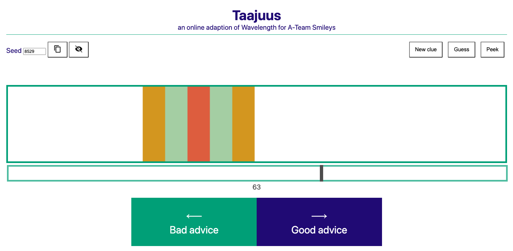

# Taajuus

Taajuus is an online adaption of the wonderful party game <a href="https://www.wavelength.zone/">Wavelength</a>. It was built during the pandemic times when playing a physical game was impossible. If the pandemic is already over, go and buy the game, you won't regret it.

_Taajuus_ is Finnish for frequency which is one half of the equation to wavelenghth, since this game is missing the most important part of the equation: physical interaction with friends.

## How to play

### Rules of the game

In Wavelength/Taajuus, two teams compete in being at the same wavelength with each other.

Each round, one team gets a prompt with two opposite qualities (for example Good/Bad). The clue giver of a team (rotate this after each round) will then see a randomly generated target they want their team to land.

After this, they'll give a clue to the other team (for example "My dog") and their team then discusses and decides where does the clue land on the spectrum. Before revealing the target, the opposing team gets to guess if it's more to left or right.

If the guess is withing colored range on the target, team gets 2-4 points. If not, the opposing teams gets 1 point if they were right.

### How to play via video call

1. Have some friends over (min. 6 to form two teams of 3)
2. A host opens the game and shares the screen
3. I recommend hiding the seed with the eye button unless you really trust your friends (anyone with access to seed can see the correct target).
4. You can either input your own seed or press `New clue` button to generate a new seed.
5. Use the copy button to share the seed URL to person who's the clue giver.
6. Clue giver clicks Peek to see the target and gives a guess.
7. Their team then discusses and tells host where to move the indicator.
8. The other team then guesses if it's more to left or more to right.
9. Host clicks Guess and points are shown.
10. Add points to the right team manually and hit `New clue` for a new round.
11. Repeat until everyone falls asleep or has to change their baby's diapers.

## Development

Taajuus is a pure HTML/CSS/JS project that requires no build tools. Just open `index.html` and you're ready to go.

## Acknowledgements

### Futurice Spice Program

Development of Taajuus has been a grateful recipient of the <a href="https://spiceprogram.fi">Futurice Open Source sponsorship program</a>.

### Telewave

This project got started as a small modification to <a href="https://github.com/gjeuken/telewave">Telewave</a> but then it turned out I needed more than just a minor improvement so I decided to rewrite it with the example of Telewave. The original prompts are from Telewave.
